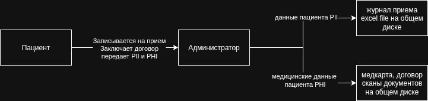
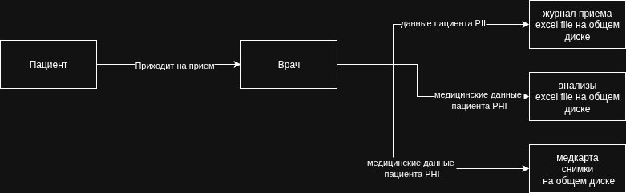
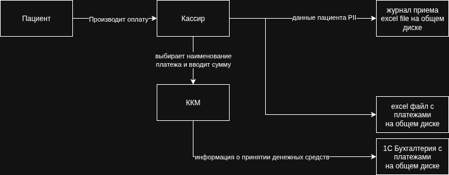
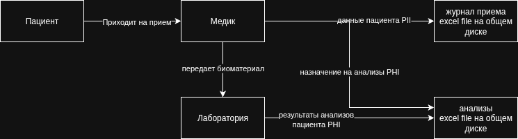
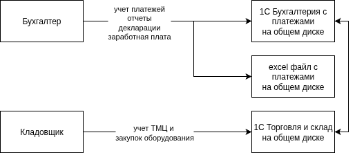
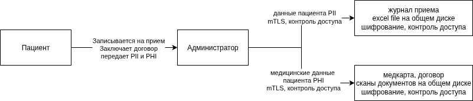
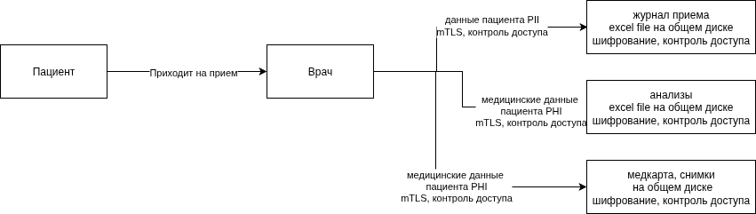
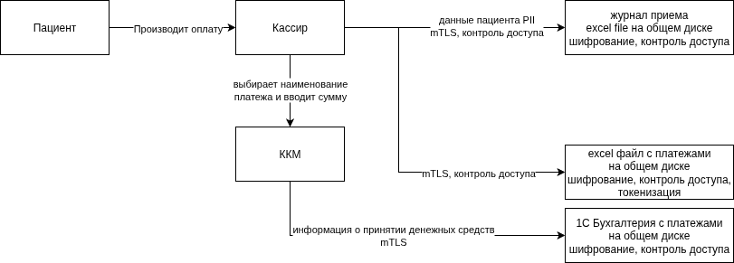
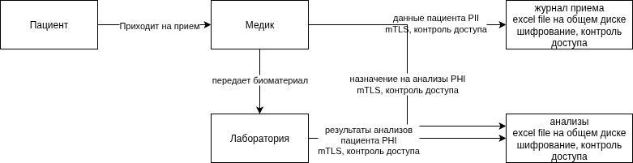
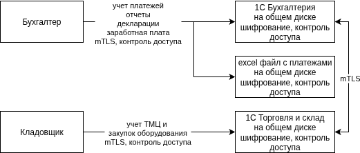

# Задание 1. Анализ безопасности системы

## Выявите конфиденциальные данные, которые не учтены во внутренних системах

### DFD запись на прием

[скачать](DFD_запись_на_прием.drawio)

### DFD прием врача

[скачать](DFD_прием_врача.drawio)

### DFD оплата услуг

[скачать](DFD_оплата_услуг.drawio)

### DFD анализы

[скачать](DFD_анализы.drawio)

### DFD другое

[скачать](DFD_другое.drawio)

## Проведите аудит мер по обеспечению безопасности данных

### Список проблемных зон

- Персональные данные собираются и хранятся избыточно, медицинские данные хранятся вместе с персональными данными
- 152 ФЗ не соответствует: журналы приёма пациентов, учёт пациентов и платежей, медицинские карты, учёт анализов ― хранятся в файлах Excel, все данные лежат на общем диске, т.е. каждый сотрудник имеет доступ ко всем данным в открытом виде (отсутствует контроль доступа)
- Нет политики удаления данных по запросу клиента, срок хранения персональных данных также не установлен
- Хранение без шифрования
- Нет резервного копирования данных
- Нет аудита доступа: отсутствует журналирование действий сотрудников над данными, никак не отслеживаются события модификаций данных
- Нет Data Loss Prevention
- Нет маркировки данных
- Передача данных через незащищённые каналы
- Данные обрабатываются сотрудниками вручную: может привести к ошибкам и искажению данных

## Что можно улучшить

### Критически важные изменения

- Организовать ролевую модель внутри организации и разграничить доступ к ресурам на основе ролей(для начала можно хоть средствами ActiveDirectory): карты и результаты анализов видят только медицинские специалисты
- Настроить механизмы доступа внутри сетевого контура организации(VLAN, ZeroTrust) с политиками безопасности, регулярной ротацией паролей и двухфакторной аутентификацией
- Настроить резервное копирование данных с шифрованием, обеспечить удаление устаревших данных или их архивацию с шифрованием

### Переход к Privacy By Design

- Провести инвентаризацию и классификацию данных: выделить общедоступные, внутренние, медицинские и конфиденциальные данные
- Определить соответсвие получаемых от клиентов данных с подходом Data Minimization, прекратить сбор излишних данные
- Внедрить механизмы аудита, логирования действий сотрудников с данными
- Обеспечить механизмы маскирования и обфускации данных на разных этапах Data Flow
- Настроить механизмы шифрования данных при хранении(BitLocker) и передаче(mTLS)
- Внедрить систему централизованного хранения данных, соответсвующую всем указанным пунктам

### Данные и методы защиты

| Тип данных                   | Примеры                                                   | Методы защиты                                         |
| ---------------------------- | --------------------------------------------------------- | ----------------------------------------------------- |
| Персональные данные          | ФИО, дата рождения, паспортные данные, телефон, email     | Шифрование, обезличивание, контроль доступа           |
| Конфиденциальные данные      | платёжные документы, журнал приемов                       | Шифрование, обфускация, контроль доступа              |
| Медицинские данные           | хронические заболевания, результаты лабораторных анализов | Шифрование, обфускация, контроль доступа              |
| Логины и пароли              | Учётные записи сотрудников                                | Шифрование, хэширование, двухфакторная аутентификация |
| Идентификаторы пользователей | ID клиентов, номера аккаунтов                             | Обезличивание, тегирование, шифрование                |
| Логи работы систем           | Журналы действий, ошибки, входы                           | Обфускация, шифрование, маскирвание, аудит            |

### Механизм тегирования

Использовать DLP или Data Governance платформу: Apache Atlas или Microsoft OneTrust
Теги:

- PII — персональные данные
- PHI — медицинские данные
- FINANCE — финансовые данные
- LOG — логи с PII

### DFD To Be

#### DFD запись на прием

[скачать](DFD_запись_на_прием_to_be.drawio)

#### DFD прием врача

[скачать](DFD_прием_врача_to_be.drawio)

#### DFD оплата услуг

[скачать](DFD_оплата_услуг_to_be.drawio)

#### DFD анализы

[скачать](DFD_анализы_to_be.drawio)

#### DFD другое

[скачать](DFD_другое_to_be.drawio)
