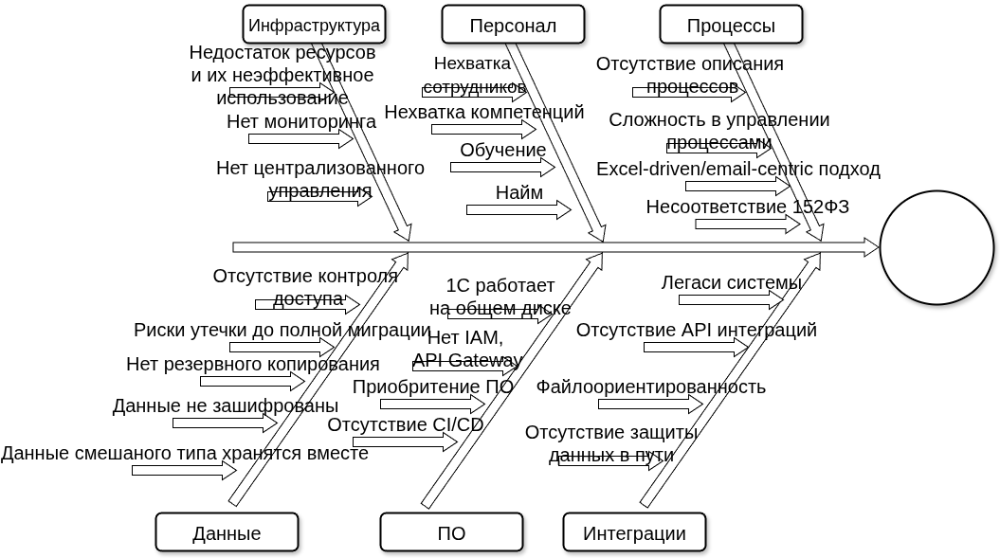

# Задание 4. Оценка узких мест при миграции

[скачать](ishikawa.drawio)

Текущая система Medicamente не обеспечивает конфиденциальность, целостность,
и доступность данных: это критический риск для бизнеса.

Предлагаемая стратегия для реализации поставленных бизнес-целей:

1. Обеспеченить защиту и управления данными в соответствие с требованиями ФЗ-152
   в текущем решении: этот риск для бизнеса носит критический характер,
   поэтому требует немедленных действий

2. Проработка решения ToBe с учетом:
   2.1 требований ФЗ-152 и лучших практик защиты и управления данными
   2.2 повышения отказоустойчивости, производительности и надежности
   2.3 автоматизация процессов
   2.4 повышение гибкости и скорости разработки

3. Поэтапная миграция: необходимо не просто реализовать новые проецссы, разработать
   микросервисы, а также необходимо мигрировать со старых процессов и систем

4. Мониторинг и аудит

## Рекомендации по устранению узких мест

Ключевым сейчас, с точки зрения снижения рисков для бизнеса, является обеспечение защиты
данных и управления в соответствие с требованиями ФЗ-152 в текущем решении

| Мера                                                                                                               | Приоритет   |
| ------------------------------------------------------------------------------------------------------------------ | ----------- |
| Доработка текущих бизнес-процессов с учетом соблюдения требований ФЗ-152, особенно ролевой модели и правил доступа | Критический |
| Аудит и классификация, безопасность данных                                                                         | Критический |
| Внедрение IAM(ActiveDirectory для начала и Keycloak в дальнейшнем) и контроля доступа к данным                     | Критический |
| Реализовать механизм резервного копирования данных с учетом шифрования и резервирования                            | Высокий     |
| С целью снижения риска утечки данных внедрить систему DLP и антивирусное ПО                                        | Высокий     |
| Настроить мониторинг, логирование и аудит                                                                          | Высокий     |
| Прoоработка решения ToBe с учетом ФЗ-152                                                                           | Выскоий     |
| Обучение персонала(в том числе требованиям ФЗ-152)                                                                 | Средний     |
| Наращивание инфраструктуры, CI/CD, отказоустойчивость                                                              | Средний     |
| Найм новых сотрудников                                                                                             | Средний     |
| Старт разработки отдельных микросервисов                                                                           | Средний     |
| Поэтапная миграция в ToBe решение с данными                                                                        | Средний     |
| Формализация процессов                                                                                             | Низкий      |
| Реализовать новые процессы управления данными (Apache Nifi)                                                        | Низкий      |
| Использовать защищенные каналы связи(в дальнейшнем для расширения)                                                 | Низкий      |
